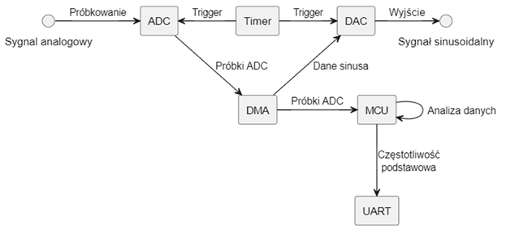
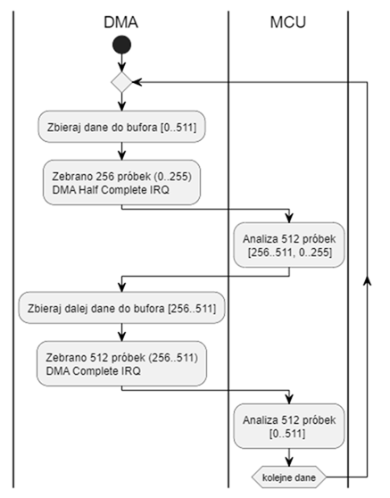
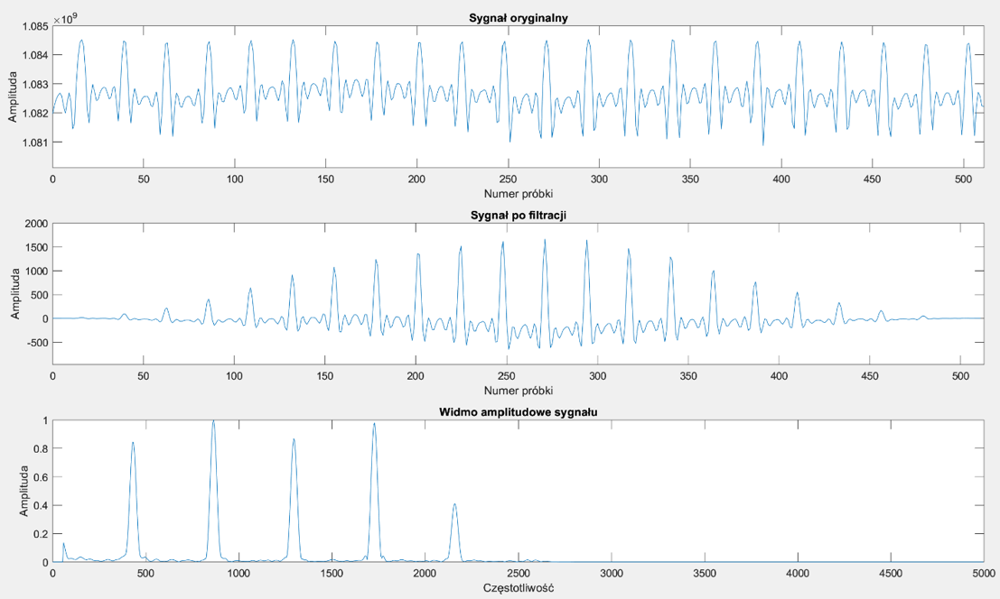

# Analizator Częstotliwości Audio i Generator Sygnału na STM32
### _Real-time Audio Frequency Analyzer & Waveform Generator on STM32_

Projekt zrealizowany na platformie deweloperskiej **NUCLEO-F446RE**, który pełni dwie kluczowe funkcje:
1.  **Analizator Częstotliwości Audio:** Próbkuje sygnał audio, przetwarza go za pomocą algorytmów DSP (Digital Signal Processing) i w czasie rzeczywistym wyznacza jego częstotliwość podstawową. Wynik jest wysyłany przez port szeregowy UART.
2.  **Generator Funkcyjny:** Równolegle, z wykorzystaniem przetwornika DAC i mechanizmu DMA, urządzenie generuje stabilny sygnał sinusoidalny o zdefiniowanej częstotliwości.

Projekt ten demonstruje efektywne wykorzystanie peryferiów mikrokontrolera STM32, takich jak ADC, DAC, DMA i Timery, do realizacji złożonych zadań przetwarzania sygnałów z minimalnym obciążeniem procesora.

---

## Kluczowe Funkcje

- 🎹 **Analiza Częstotliwości:** Precyzyjne wykrywanie częstotliwości podstawowej w zakresie **78 Hz - 1109 Hz**.
- 🚀 **Wysokowydajne Próbkowanie:** Wykorzystanie Timera do precyzyjnego wyzwalania przetwornika **ADC** z częstotliwością **10 kHz**, z transferem danych obsługiwanym w całości przez **DMA**, co odciąża rdzeń procesora.
- 🔄 **Buforowanie Ping-Pong:** Implementacja mechanizmu podwójnego buforowania (ping-pong) za pomocą przerwań DMA (`HalfCplt` i `Cplt`), co pozwala na ciągłą analizę sygnału bez utraty próbek.
- 🔬 **Zaawansowany Potok DSP:** Sygnał jest przetwarzany przez:
    - Filtr cyfrowy **FIR** w celu usunięcia niepożądanych składowych.
    - Nałożenie **okna Hanna** w celu przygotowania sygnału do analizy w dziedzinie częstotliwości.
    - Obliczenie **Szybkiej Transformacji Fouriera (FFT)** przy użyciu zoptymalizowanej biblioteki CMSIS-DSP.
- 🎯 **Inteligentny Algorytm Detekcji:** Algorytm analizuje widmo sygnału, wyszukuje maksimum, a następnie sprawdza prążki subharmoniczne (f/2, f/3, f/4), aby poprawnie zidentyfikować częstotliwość podstawową, a nie jej silniejszą harmoniczną.
- 〰️ **Generator Sinusoidy:** Przetwornik **DAC** z **DMA** generuje falę sinusoidalną na podstawie pre-kalkulowanej tablicy, działając w pełni autonomicznie w tle.

---

## Architektura i Przepływ Danych

System został zaprojektowany w celu maksymalizacji współbieżności i minimalizacji zaangażowania CPU w transfer danych.

  
   
  <em>Rys. 1: Schemat blokowy przepływu sygnałów w mikrokontrolerze.</em>

  
   
  <em>Rys. 2: Diagram współpracy DMA i MCU w mechanizmie ping-pong.</em>

1.  **Timer** generuje sygnał wyzwalający dla ADC i DAC z częstotliwością 10 kHz.
2.  **ADC** próbkuje sygnał analogowy.
3.  **DMA (kanał ADC)** transferuje próbki do 512-elementowego bufora w pamięci RAM.
4.  Po zebraniu 256 próbek (**Half Complete**) i 512 próbek (**Complete**), DMA generuje przerwanie dla **MCU**.
5.  **MCU** w procedurze obsługi przerwania wykonuje analizę DSP na fragmencie bufora, który właśnie został zapełniony, podczas gdy DMA w tle zapisuje nowe próbki do drugiej połowy bufora.
6.  Wynik analizy (wykryta częstotliwość) jest wysyłany przez **UART**.
7.  Równolegle, **DMA (kanał DAC)** w pętli przesyła tablicę wartości sinusoidy do przetwornika **DAC**, generując sygnał na wyjściu.

---

## Wyniki Analizy

Poniżej przedstawiono przykład analizy sygnału testowego o częstotliwości 440 Hz, złożonego z harmonicznych. Wykresy pokazują sygnał oryginalny, sygnał po filtracji i nałożeniu okna, oraz finalne widmo amplitudowe z wyraźnie zidentyfikowaną częstotliwością podstawową.

  
   
  <em>Rys. 3: Etapy przetwarzania sygnału testowego 440 Hz.</em>

---

## Zastosowane Technologie

#### 🛠️ Sprzęt
- **Płytka deweloperska:** STMicroelectronics NUCLEO-F446RE

#### 💻 Oprogramowanie i Biblioteki
- **Język:** C
- **Środowisko IDE:** STM32CubeIDE
- **Kluczowe Biblioteki i Koncepcje:**
  - Biblioteka **STM32 HAL**
  - Biblioteka **CMSIS-DSP** (dla zoptymalizowanych funkcji FIR i FFT)
  - **DMA** z trybem cyklicznym i przerwaniami (Ping-Pong Buffer)
  - Peryferia: **ADC**, **DAC**, **Timers**, **UART**
  - Algorytmy: **FFT**, **Filtr FIR**, **Okno Hanninga**

---

## Licencja

Ten projekt jest udostępniony na licencji MIT - zobacz plik [LICENSE](LICENSE) po szczegóły.